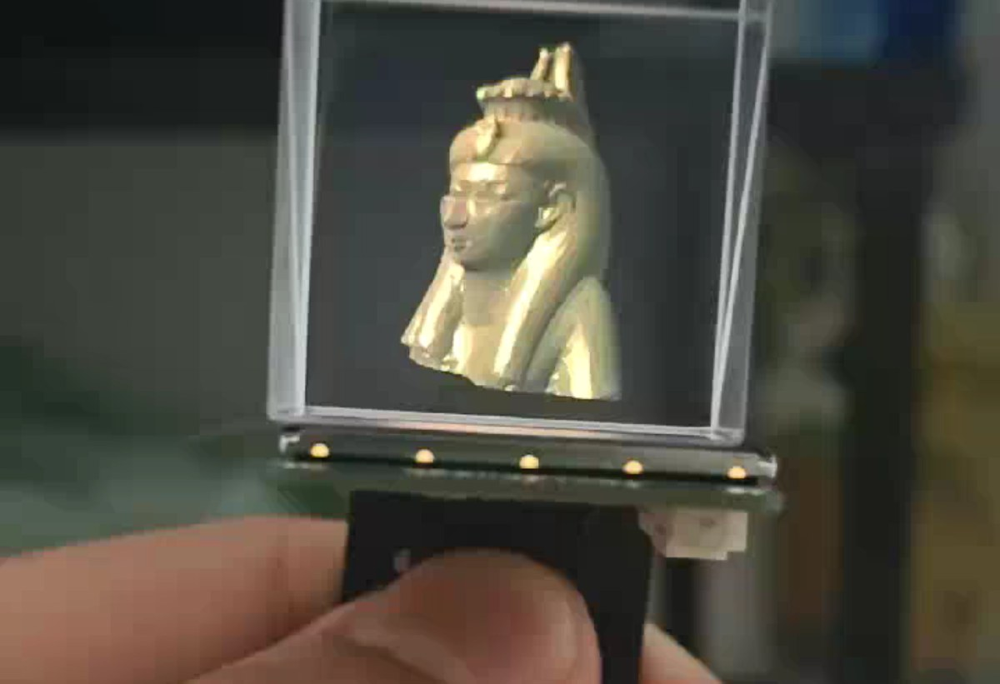
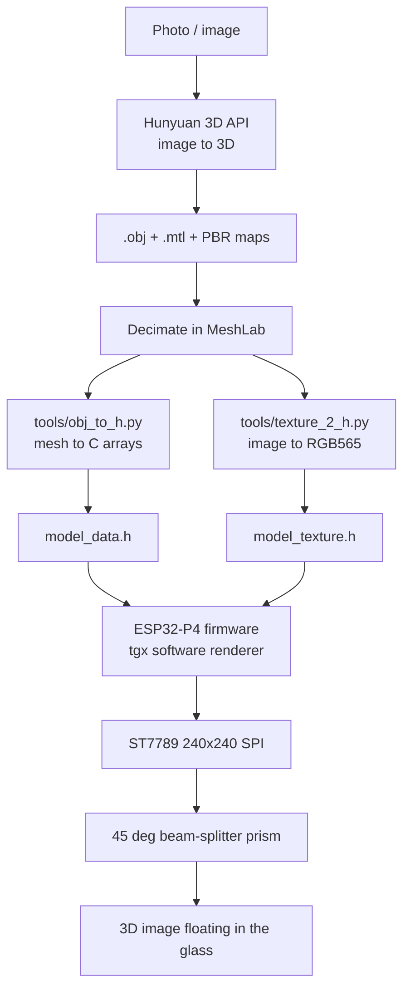

# Holo Pet — Photo to Hologram on ESP32 (Prototype)


Turn a photo into a small 3D character that floats in mid-air. This is the first working prototype of a **digital desktop pet**: an image is turned into a 3D model with the Tencent **Hunyuan 3D** API, converted into C arrays, rendered in software on an **ESP32-P4**, and displayed through a **45° beam-splitter prism** — so the character appears to hang inside the glass.

Everything on the render side runs on the MCU: perspective projection, z-buffering, back-face culling, Gouraud / flat shading and texture sampling, with no GPU and no external graphics chip.

## Demo

[](docs/media/demo.mp4)

▶ **[Watch the demo video](docs/media/demo.mp4)** — 18 s, 720×1280, 2 MB. The shot above is the first frame: the hand-held assembly with the rendered model floating inside the prism.

## How it works



**The optical part.** A single 45° beam-splitter prism sits above the display. The screen's image is reflected by the splitter's angled surface, and the virtual image it forms appears *behind* that surface — visually inside the glass. Because the reflected image looks like a solid object sitting in the prism, the character reads as a small floating hologram.

One 45° splitter gives one comfortable viewing direction. A four-sided pyramid would give four, at the cost of brightness and build complexity — that is a later step (see [Status](#status)).

## Firmware features

- **Full software 3D pipeline** — perspective projection, z-buffer and back-face culling, triangles rasterised on the chip
- **Four shading modes**, cycled automatically so they can be compared back to back:
  1. Gouraud shading + texture mapping
  2. Wireframe
  3. Flat shading
  4. Gouraud shading
- **Looping camera animation** — the model rotates continuously while the camera runs through a four-stage path (wide shot → push in → close-up → pull back), 1 revolution every 4 s, mode changes every 16 s
- **FPS reporting** over serial at 115200 baud
- **Frame-rate cap** of 33 ms per frame (~30 FPS) to keep the SPI refresh from saturating the bus

## Hardware

| ESP32-P4 | ST7789 | Signal |
|---|---|---|
| GPIO 25 | CS | Chip select |
| GPIO 2 | DC | Data / command |
| GPIO 3 | RST | Reset |
| GPIO 33 | SDA (MOSI) | SPI data |
| GPIO 26 | SCL (SCK) | SPI clock |
| GPIO 48 | BLK | Backlight |

| Parameter | Value |
|---|---|
| Display | ST7789, 240×240, SPI |
| SPI clock | 80 MHz |
| Optics | Single 45° beam-splitter prism above the display |
| Refresh | Full-frame `drawRGBBitmap`, capped at 33 ms per frame |
| Camera | Perspective, 45° FOV, near 1.0, far 100.0 |
| Material | `RGBf(0.85, 0.55, 0.25)`, ambient 0.2, diffuse 0.7, specular 0.8, shininess 64 |

Pin assignments and screen parameters live at the top of [`holo_viewer.ino`](firmware/holo_viewer/holo_viewer.ino) — adjust them there if your wiring differs.

## Dependencies

| Dependency | Purpose |
|---|---|
| Arduino ESP32 core (with ESP32-P4 support) | Framework |
| [Adafruit GFX Library](https://github.com/adafruit/Adafruit-GFX-Library) | Graphics primitives |
| [Adafruit ST7789 Library](https://github.com/adafruit/Adafruit-ST7735-Library) | Display driver |
| [tgx](https://github.com/luni64/tgx) | 3D software renderer |
| Tencent Hunyuan 3D API | Image to 3D model (used offline, no code in this repo) |

The Python helpers need:

```bash
pip install -r requirements.txt   # Pillow + numpy, used by texture_2_h.py
```

`tools/obj_to_h.py` uses the standard library only.

## Repository layout

```
.
├── firmware/
│   └── holo_viewer/
│       ├── holo_viewer.ino     # Arduino sketch: animation + render loop
│       ├── model_data.h        # generated mesh data: vertices / UVs / normals / faces
│       └── model_texture.h     # generated RGB565 texture, 240×240
├── models/
│   ├── museum/                 # Egyptian pharaoh bust: full-res source + decimated mesh
│   ├── nailong/                # the desk-pet character, built from a photo via Hunyuan 3D
│   ├── tv/                     # leftover MeshLab test asset, not used by the firmware
│   └── pin/                    # badge model drafts (Blender sources only)
├── tools/
│   ├── obj_to_h.py             # .obj  -> C header (vertices / normals / faces)
│   └── texture_2_h.py          # image -> RGB565 C header
├── assets/textures/            # source textures
├── docs/
│   ├── images/                 # README figures
│   └── media/                  # demo video
├── requirements.txt
└── README.md
```

## Getting started

### 1. Generate the model header

```bash
python tools/obj_to_h.py
```

The script walks through these prompts:

| Prompt | Meaning |
|---|---|
| `name of the .obj file ?` | Path to the OBJ file |
| `name of this model ?` | Variable name to generate — enter `model` to match the firmware |
| Translate / resize to fit `[-1,1]³`? | Normalises the model bounding box |
| Compute smooth normals? | Affects the shading result |
| Per-object color / lighting / texture name | Press Enter to accept the defaults |

Output: `<name>.h`, containing the vertex, UV, normal and face-index arrays plus a `tgx::Mesh3D<tgx::RGB565>` object. The header also emits `#include "<name>_texture.h"`, so generate the texture header with the same name and copy both into `firmware/holo_viewer/` (the firmware expects `model_data.h` and `model_texture.h`).

### 2. Generate the texture header

```bash
python tools/texture_2_h.py
```

Enter the image path, the target width/height and the texture name. The image is converted to RGB565 and written to `<name>_texture.h`. **Texture dimensions must be powers of two**, otherwise the image cannot be used for texture mapping. A 240×240 texture costs 112.5 KB of flash.

### 3. Build and flash

Open `firmware/holo_viewer/holo_viewer.ino` in the Arduino IDE (the sketch directory name matches the `.ino` file, as the IDE requires), select your ESP32-P4 board, install the libraries listed above, then compile and upload. The serial monitor at 115200 baud prints the initialisation steps and a frame rate once per second.

### 4. Assemble the optics

Mount the display at the base of the prism so that the screen faces the splitter's angled surface, then view it from the front. The image reflected by the splitter appears to float inside the glass.

## Model assets

| Directory | Description | Size |
|---|---|---|
| `models/museum` | Egyptian pharaoh bust — the demo subject. `museum.obj` is the full-resolution scan, `museum_decimated.obj` the version the flashed firmware was generated from | 53,171 verts / 100,000 faces → 7,032 verts / 9,000 faces |
| `models/nailong` | The desk-pet character, generated from a photo with Hunyuan 3D. Kept as the next model to put on the device | 5,802 verts / 6,000 faces, 3 × 4096² PBR maps |
| `models/tv` | Retro television set simplified in MeshLab — an early test asset, **not** used by the current firmware | 4,026 verts / 8,020 faces |
| `models/pin` | Badge model drafts (Blender sources only) | — |

The flashed header holds 9,302 vertices / 12,999 triangles: the decimated pharaoh mesh after `obj_to_h.py` splits vertices along UV and normal seams.

## Memory footprint

| Item | Size |
|---|---|
| Color framebuffer `fb` (240×240 × 2 B) | 112.5 KB |
| Depth buffer `zbuf` (240×240 × 2 B) | 112.5 KB |
| Mesh data in flash (9,302 verts / 12,999 tris) | ~398 KB |
| Texture (240×240 RGB565) | 112.5 KB |

Mesh data and the texture live in flash via `PROGMEM`; the two framebuffers take roughly 225 KB of RAM.

## Status

Working today:

- Photo → Hunyuan 3D → decimate → convert → flash → floating image in the prism, end to end
- The camera animation and the four shading modes run at a stable, capped frame rate

Planned, not implemented:

- Put the Hunyuan-generated character (`models/nailong`) on the device instead of the demo bust
- Idle animations and simple reactions, so it behaves like a pet rather than a turntable
- A four-sided prism for 360°-ish viewing, plus brightness tuning
- A proper enclosure instead of the hand-held breadboard build in the clip

## Notes and limitations

- Rendering is done entirely on the MCU, so resolution, texture size and polygon budget are all tied to the clock speed
- The display is refreshed as whole frames, so the achievable frame rate is bounded by SPI bandwidth (the FPS printed over serial is the authoritative figure)
- A single 45° splitter means the illusion only holds from roughly one direction, and the floating image is dimmer than the screen itself
- Textures must be power-of-two sized
- Animation timings, camera path and material parameters are hard-coded in `holo_viewer.ino`
- The application calls the Hunyuan 3D API outside this repo; no API keys or calls are stored here

## Acknowledgements

- 3D rendering is built on [tgx](https://github.com/luni64/tgx) by luni64
- Display driving uses Adafruit's GFX and ST7789 libraries
- Meshes were simplified with [MeshLab](https://www.meshlab.net/)
- Image-to-3D generation uses Tencent Hunyuan 3D

## License

This project is a personal work and does not carry an open-source license yet. If you would like to reuse it, please get in touch.
